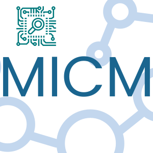

MICM Chemistry
==============

Model Independent Chemical Module. MICM can be used to configure and solve atmospheric chemistry systems.

[](https://github.com/NCAR/micm/releases)
[](https://github.com/NCAR/micm/blob/master/LICENSE)
[](https://github.com/NCAR/micm/actions/workflows/docker_and_coverage.yml)
[](https://github.com/NCAR/micm/actions/workflows/windows.yml)
[](https://github.com/NCAR/micm/actions/workflows/mac.yml)
[](https://github.com/NCAR/micm/actions/workflows/ubuntu.yml)
[](https://codecov.io/gh/NCAR/micm)
[](https://zenodo.org/badge/latestdoi/294492778)
[](https://fairsoftwarechecklist.net/v0.2?f=31&a=32113&i=22322&r=123)


Copyright (C) 2018-2024 National Center for Atmospheric Research


<p align="center">
  
</p>

> **Note**
> MICM 3.x.x is part of a refactor and may include breaking changes across minor revision numbers
and partially implemented features


# Getting Started

## Installing MICM locally
To build and install MICM locally, you must have CMake installed on your machine.

Open a terminal window, navigate to a folder where you would like the MICM files to exist,
and run the following commands:

```
git clone https://github.com/NCAR/micm.git
cd micm
mkdir build
cd build
ccmake ..
sudo make install -j 8
```

To run the tests:

```
make test
```

If you would later like to uninstall MICM, you can run
`sudo make uninstall` from the `build/` directory.

## Options

There are multiple options for running micm. You can use [json](https://github.com/nlohmann/json)
to configure a solver, [llvm](https://llvm.org/) to JIT-compile
solvers on CPUs or [cuda](https://developer.nvidia.com/cuda-zone)-based solvers to solve chemistry on GPUs.
Please [read our docs](https://ncar.github.io/micm/getting_started.html) 
to learn how to enable these options.

## Running a MICM Docker container

You must have [Docker Desktop](https://www.docker.com/get-started) installed and running.
With Docker Desktop running, open a terminal window.
To build the latest MICM release, run the following command to start the MICM container:

```
docker run -it ghcr.io/ncar/micm:release bash
```

To build the latest pre-release version of MICM, instead run:

```
git clone https://github.com/NCAR/micm.git
cd micm
docker build -t micm -f docker/Dockerfile .
docker run -it micm bash
```

Inside the container, you can run the MICM tests from the `/build/` folder:

```
cd /build/
make test
```

# Using the MICM executable

A simple driver for MICM is built with the library and can be used to solve a
chemical system for given initial conditions over one time step.

Just pass the driver the path to the folder containing a valid JSON
mechanism configuration and the path to a CSV file holding the initial
conditions.

Several example mechanisms and sets of conditions can be found in the
`/examples/configs/` folder.

You can use them like this:

```
micm examples/configs/chapman examples/configs/chapman/initial_conditions.csv
```

The output should be:

```
 time,          O,        O1D,         O2,         O3
    0,   0.00e+00,   0.00e+00,   7.50e-01,   8.10e-06
   60,   2.57e-12,   3.49e-22,   7.50e-01,   8.10e-06
```

# Using the MICM API

The following example solves the fictitious chemical system:

```
foo       --k1--> 0.8 bar + 0.2 baz
foo + bar --k2--> baz
```
The `k1` and `k2` rate constants are for Arrhenius reactions. See the [MICM documentation](https://ncar.github.io/micm/) for details on the types of reactions available in MICM and how to configure them.

To solve this system save the following code in a file named `foo_chem.cpp`:

```c++
#include <iomanip>
#include <iostream>
#include <micm/process/arrhenius_rate_constant.hpp>
#include <micm/solver/rosenbrock.hpp>

using namespace micm;

int main(const int argc, const char *argv[])
{
  auto foo = Species{ "Foo" };
  auto bar = Species{ "Bar" };
  auto baz = Species{ "Baz" };

  Phase gas_phase{ std::vector<Species>{ foo, bar, baz } };

  System chemical_system{ SystemParameters{ .gas_phase_ = gas_phase } };

  Process r1 = Process::create()
                   .reactants({ foo })
                   .products({ Yield(bar, 0.8), Yield(baz, 0.2) })
                   .rate_constant(ArrheniusRateConstant({ .A_ = 1.0e-3 }))
                   .phase(gas_phase);

  Process r2 = Process::create()
                   .reactants({ foo, bar })
                   .products({ Yield(baz, 1) })
                   .rate_constant(ArrheniusRateConstant({ .A_ = 1.0e-5, .C_ = 110.0 }))
                   .phase(gas_phase);

  std::vector<Process> reactions{ r1, r2 };

  RosenbrockSolver<> solver{ chemical_system, reactions, RosenbrockSolverParameters::three_stage_rosenbrock_parameters() };

  State state = solver.GetState();

  state.conditions_[0].temperature_ = 287.45;  // K
  state.conditions_[0].pressure_ = 101319.9;   // Pa
  state.SetConcentration(foo, 20.0);           // mol m-3

  state.PrintHeader();
  for (int i = 0; i < 10; ++i)
  {
    auto result = solver.Solve(500.0, state);
    state.variables_ = result.result_;
    state.PrintState(i*500);
  }

  return 0;
}
```

To build and run the example using GNU (assuming the default install location):
```
g++ -o foo_chem foo_chem.cpp -I/usr/local/micm-3.3.1/include -std=c++20
./foo_chem
```

Output:
```
 time,        Bar,        Baz,        Foo
    0,   5.90e+00,   1.91e+00,   1.18e+01
  500,   9.05e+00,   3.32e+00,   6.79e+00
 1000,   1.07e+01,   4.21e+00,   3.83e+00
 1500,   1.17e+01,   4.74e+00,   2.14e+00
 2000,   1.22e+01,   5.04e+00,   1.19e+00
 2500,   1.24e+01,   5.21e+00,   6.58e-01
 3000,   1.26e+01,   5.31e+00,   3.64e-01
 3500,   1.27e+01,   5.36e+00,   2.01e-01
 4000,   1.27e+01,   5.39e+00,   1.11e-01
 4500,   1.28e+01,   5.41e+00,   6.13e-02
```
# Citation

MICM is part of the MUSICA project and can be cited by reference to the MUSICA vision paper. The BibTeX entry below can be used to generate a citation for this.

```
@Article { acom.software.musica-vision,
    author = "Gabriele G. Pfister and Sebastian D. Eastham and Avelino F. Arellano and Bernard Aumont and Kelley C. Barsanti and Mary C. Barth and Andrew Conley and Nicholas A. Davis and Louisa K. Emmons and Jerome D. Fast and Arlene M. Fiore and Benjamin Gaubert and Steve Goldhaber and Claire Granier and Georg A. Grell and Marc Guevara and Daven K. Henze and Alma Hodzic and Xiaohong Liu and Daniel R. Marsh and John J. Orlando and John M. C. Plane and Lorenzo M. Polvani and Karen H. Rosenlof and Allison L. Steiner and Daniel J. Jacob and Guy P. Brasseur",
    title = "The Multi-Scale Infrastructure for Chemistry and Aerosols (MUSICA)",
    journal = "Bulletin of the American Meteorological Society",
    year = "2020",
    publisher = "American Meteorological Society",
    address = "Boston MA, USA",
    volume = "101",
    number = "10",
    doi = "10.1175/BAMS-D-19-0331.1",
    pages= "E1743 - E1760",
    url = "https://journals.ametsoc.org/view/journals/bams/101/10/bamsD190331.xml"
}
```

# Community and contributions
We welcome contributions and feedback from anyone, everything from updating
the content or appearance of the documentation to new and
cutting edge science.

- [Collaboration](https://github.com/NCAR/musica/blob/main/docs/Software%20Development%20Plan.pdf)
  - Anyone interested in scientific collaboration
which would add new software functionality should read the [MUSICA software development plan](https://github.com/NCAR/musica/blob/main/docs/Software%20Development%20Plan.pdf).

- [Code of conduct](CODE_OF_CONDUCT.md)
  - Please read this through to you understand the expectations with how to interact with this project.

- [Contributor's guide](https://ncar.github.io/micm/contributing/index.html)
  - Before submiitting a PR, please thouroughly read this to you understand our expectations. We reserve the right to reject any PR not meeting our guidelines.


# Documentation
Please see the [MICM documentation](https://ncar.github.io/micm/) for detailed
installation and usage instructions.

# License

- [Apache 2.0](/LICENSE)

Copyright (C) 2018-2024 National Center for Atmospheric Research
