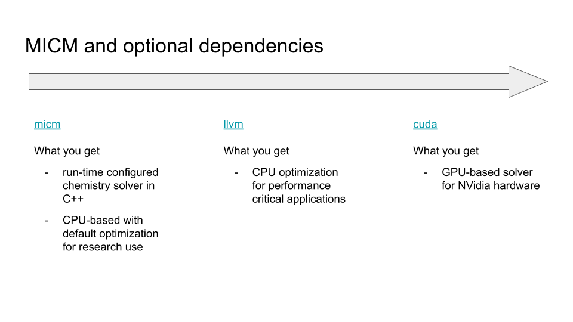

###############
Getting Started
###############

Build and Test
==============

Configuring for different platforms and environments is shown here. There is an additional tutorial which covers 
some other specifics: :ref:`Installation and usage`.

CPU
---
To build and install MICM locally, you must have the following libraries installed:

- `CMake <https://cmake.org/>`_
  - `installation <https://cmake.org/download/>`_

Then, it's enough for you to configure and install micm on your computer. Because micm is header-only library, the install
step will simply copy the header files into the normal location required by your system.

.. code-block:: console
  
    $ git clone https://github.com/NCAR/micm.git
    $ cd micm
    $ mkdir build
    $ cd build
    $ ccmake ..
    $ make install -j 8
    $ make test

CMake will allow for setting options such as the installation directory
with CMAKE_INSTALL_PREFIX, or various build flags such as MICM_BUILD_DOCS, MICM_ENABLE_CUDA, etc.

Options
-------

MICM can optionally include support for json configuration reading, OpenMP,
JIT-compiled chemistry functions, and GPUs. Each of these requires an additional library. 
Some of these libraries can be included automatically with cmake build options,
others require that you have libraries installed on your system.

- JSON configuration support
  - When building micm, you need to enable the JSON option. This will download and configure the `nlohmann/jsoncpp library <https://github.com/nlohmann/json>`_  for you. For example: ``cmake -DMICM_ENABLE_JSON=ON ..``
- JIT-compiled chemistry functions 
  - This requires `LLVM <https://llvm.org/docs/index.html>`_ to be installed with on your system. Once it is, you can include the jit options with ``cmake -DENBABLE_LLVM=ON ..``
- GPU support
  - Coming soon
- OpenMP
  - On macOS, you either need to configure cmake to use gcc which ships with OpenMP (either ``CXX=g++ cmake -DMICM_ENABLE_OPENMP=ON ..`` or ``cmake -DCMAKE_CXX_COMPILER=g++ -DMICM_ENABLE_OPENMP=ON ..``)

For more ways to build and install micm, see :ref:`Installation and usage`. If you would like instructions for building
the docs, see :ref:`Contributing`.

Docker Container
----------------

Build and run the image::

    $ docker build -t micm -f docker/Dockerfile.nvhpc .
    $ docker run --rm -it micm

If you would like, you can ssh into a running docker container and edit the files there.

Run an Example
--------------

MICM Executable Example
^^^^^^^^^^^^^^^^^^^^^^^

A simple driver for MICM is built with the library and can be used to solve a
chemical system for given initial conditions over one time step.

Just pass the driver the path to the folder containing a valid JSON
mechanism configuration and the path to a CSV file holding the initial
conditions.

Several example mechanisms and sets of conditions can be found in the
``/examples/configs/`` folder.

You can use them like this::

  $ micm examples/configs/chapman examples/configs/chapman/initial_conditions.csv

The output should be::

  time,          O,        O1D,         O2,         O3
     0,   0.00e+00,   0.00e+00,   7.50e-01,   8.10e-06
    60,   2.57e-12,   3.49e-22,   7.50e-01,   8.10e-06

MICM API Example
^^^^^^^^^^^^^^^^
The following example solves the fictitious chemical system::

  foo       --k1--> 0.8 bar + 0.2 baz
  foo + bar --k2--> baz

The `k1` and `k2` rate constants are for Arrhenius reactions.
See the `MICM documentation <https://ncar.github.io/micm/>`
for details on the types of reactions available in MICM and how to configure them.
To solve this system save the following code in a file named `foo_chem.cpp`

.. literalinclude:: ../../test/tutorial/test_README_example.cpp
  :language: cpp

To build and run the example using GNU::

  $ g++ -o foo_chem foo_chem.cpp -I<CMAKE_INSTALL_PREFIX>/include -std=c++20
  $ ./foo_chem

You should see an output including this

.. csv-table::
   :header: "time [s]", "foo", "bar", "baz"
   :widths: 6, 10, 10, 10

    0.000000,  11.843503,   5.904845,   1.907012
    500.000000,   6.792023,   9.045965,   3.317336
    1000.000000,   3.828700,  10.740589,   4.210461
    1500.000000,   2.138145,  11.663685,   4.739393
    2000.000000,   1.187934,  12.169452,   5.042503
    2500.000000,   0.658129,  12.447502,   5.213261
    3000.000000,   0.363985,  12.600676,   5.308597
    3500.000000,   0.201076,  12.685147,   5.361559
    4000.000000,   0.111028,  12.731727,   5.390884
    4500.000000,   0.061290,  12.757422,   5.407096

