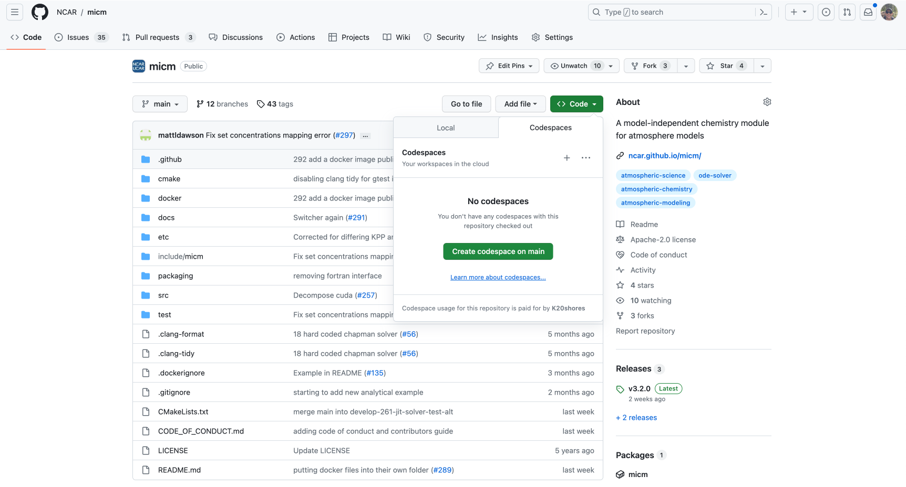

.. _Installation and usage:

Installation and usage
======================

This tutorial is going to focus **only** and how to install micm and/or include it 
into your project in multiple different ways. Any API specific details will be elided and will be covered 
in another tutorial.

Github codespace
----------------

If you want to play around with micm without figuring out how to include it in your local setup, this is the **easiest** 
option. Github codespaces offers a cloud-hosted version of Visual Studio Code configured to work with specific projects.
We've set one up for micm. It'll allow you to instantly run the tests and make changes. Please note that there is a cap on
the number of hours your personal github account has each month. Follow these instructions to see your 
`github codespace usage <https://docs.github.com/en/billing/managing-billing-for-github-codespaces/viewing-your-github-codespaces-usage>`_.
At the time of this writing, there was a maximum of 120 core-houres allowed for github codespaces for free accounts.

To set this up, on the github page for `micm <https://github.com/NCAR/micm>`_, poke on the green code button and choose the
codespaces tab and select "create codespace on main". This will open up a new tab and start building a cloud environment 
running an instance of VSCode with the micm repository displayed and all of the tests prebuilt.

The first time that you open up a codespace, it will spend some time building the image and then compiling the test files.
Onces that's done, you can move into the build direcotry and run the tests.

.. code-block:: bash

  cd build
  make test

From an archive
---------------

All versions of micm are associated with a github `release <https://github.com/NCAR/micm/releases>`_. 
Each release includes a tarall and zip that you can use to grab the code.

Find a release of micm that you want to build and download that archive. You can either do this with the browser by
poking on the desired file or with the commands below.

Zip
^^^
.. code-block:: bash

  wget https://github.com/NCAR/micm/archive/refs/tags/v3.2.0.zip
  unzip v3.2.0.zip
  cd micm-3.2.0 
  mkdir build && cd build
  cmake ..
  make -j 8
  make test

Tarball
^^^^^^^
.. code-block:: bash

  wget https://github.com/NCAR/micm/archive/refs/tags/v3.2.0.tar.gz
  tar -xf v3.2.0.tar.gz
  cd micm-3.2.0 
  mkdir build && cd build
  cmake ..
  make -j 8
  make test

Cloning from github
-------------------

.. code-block:: bash

  git clone https://github.com/NCAR/micm.git
  cd micm
  mkdir build && cd build
  cmake ..
  make -j 8
  make test

Cmake
-----

micm is developed with cmake support. This makes the inclusion of micm into projects that use cmake especially easy.

Fetch content (recommended)
^^^^^^^^^^^^^^^^^^^^^^^^^^^

External project
^^^^^^^^^^^^^^^^

Debugging
---------

VS Code
^^^^^^^

Xcode
^^^^^

Visual Studio
^^^^^^^^^^^^^