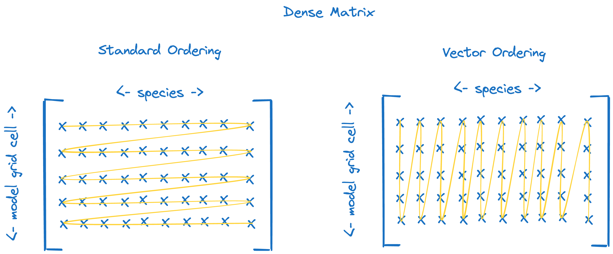

.. _Vectorized matrix solver:

Vectorized matrix solver
########################

Many of the tutorials have defined a chemical system without talking about their location. Each of these is essentially
defining a `box model <https://en.wikipedia.org/wiki/Climate_model#Box_models>`_. We often want to model chemistry
in more than one location; multiple boxes. In weather and climate models, the domain is broken up into 2d or 3d grids.
Each location may be referred to as a grid cell or column. With ``micm``, we can solve multiple grid cells simultaneously in
several ways.

The tutorials listed below solve chemistry in more than one grid cell.

* :ref:`Multiple grid cells`, this tutorial does so with a different data structure
* :ref:`OpenMP`, this tutorial uses a single thread per grid cell

In :ref:`Multiple grid cells` we assumed we were solving for the concentrations of an :math:`N\times D` matrix, :math:`N` species and 
:math:`D` grid cells. However, we used the default matrix ordering in that tutorial. This is fine for simulations that aren't
too large, but computationally may be inferior. This is because the same species appears in each grid cell, :math:`N` elements
away from each other in memory. When solving the chemical equations, the same mathematical operations have to be applied to each
species. We can organize the memory of the matrix so that the same species across all :math:`D` grid cells are directly next
to each other in memory. In this way, we help to encourage the compiler to vectorize the code and take advantage of 
`SIMD instructions <https://en.wikipedia.org/wiki/Single_instruction,_multiple_data>`_.

Organizing the data this way may be familiar to GPU programmers as
`coalesced memory access <https://www.sciencedirect.com/topics/computer-science/memory-access-coalescing>`_.

To understand this, we'll look at how the memeory is organized when solving the robertson equations with 3 grid cells using
the various matrix types and ordering in ``micm``.

.. math::

  A &\longrightarrow B, &k_{1, \mathrm{user\ defined}} \\
  2B &\longrightarrow B + C, &k_{2, \mathrm{user\ defined}} \\
  B + C &\longrightarrow A + C, \qquad &k_{3, \mathrm{user\ defined}} \\

This entire example is contained below. Copy and paste to follow along.

.. tab-set::

    .. tab-item:: Build the Mechanism with the API

        .. literalinclude:: ../../../test/tutorial/test_vectorized_matrix_solver.cpp
          :language: cpp

Matrix types in micm
--------------------

``micm`` has its own matrix types. These provide dense matrices (for species concentrations, reaction rates, etc.),
and sparse matrices (for the Jacobian matrix).
The elements of these matrices are placed in a contiguous vector, in an effort to minimize cache misses.
Both dense and sparse matrices also have two strategies for element ordering available: standard and vector.
The vector-ordering strategy is intented to encourage vectorization of the solver code.

Dense and sparse matrix types are described in more detail below.

Dense matrix
^^^^^^^^^^^^

   Element ordering for standard (left) and vector (right) ordered dense matrices.

* :cpp:class:`micm::Matrix`, a dense matrix, what you probably think of when you think of a matrix, with the caveat that all rows and columns live in one long array

* :cpp:class:`micm::VectorMatrix`, the same as :cpp:class:`micm::Matrix`, except that the data is ordered such that columns, rather than rows, are contiguous in memory.

Dense matrix: standard ordering
^^^^^^^^^^^^^^^^^^^^^^^^^^^^^^^

Up until now, we've mostly created our :cpp:class:`micm::RosenbrockSolver` solvers like this:

.. literalinclude:: ../../../test/tutorial/test_vectorized_matrix_solver.cpp
  :language: cpp
  :lines: 86

The empty angle brackets ``<>`` tell the compiler to use the default template paramters. The first two are most important and
denote the ``MatrixPolicy`` and ``SparseMatrixPolicy`` to be used when we solve. By default, these are :cpp:class:`micm::Matrix`
and :cpp:class:`micm::SparseMatrix`. The most visible data affected by these paratemeters is the state's 
:cpp:member:`micm::State::variables_` parameter, representing the concnetration of each of the species. 

After we created that first ``solver``, if we get a state and set the concentration of the species and then print them,
they are printed in order of grid cell (columns) first and then species (rows).
Here, when setting the species, read the double as ``grid cell.species``.

.. literalinclude:: ../../../test/tutorial/test_vectorized_matrix_solver.cpp
  :language: cpp
  :lines: 88-97

.. code-block:: bash

  1.1
  1.2
  1.3
  2.1
  2.2
  2.3
  3.1
  3.2
  3.3

Dense matrix: vector ordering
^^^^^^^^^^^^^^^^^^^^^^^^^^^^^

But, if we create a vectorized solver, set the same concentrations and print out the state variables, we see that it is organized
first by species (rows) and then by grid cell (columns).
Note that we needed to set some partial template specializations at the top of the file to create these.

At the top of the file:

.. literalinclude:: ../../../test/tutorial/test_vectorized_matrix_solver.cpp
  :language: cpp
  :lines: 14-18

and then we pass these templates as the template arguments to the vectorized Rosenbrock solver 

.. literalinclude:: ../../../test/tutorial/test_vectorized_matrix_solver.cpp
  :language: cpp
  :lines: 101-112

.. code-block:: bash

  1.1
  2.1
  3.1
  1.2
  2.2
  3.2
  1.3
  2.3
  3.3

And that's all you have to do to orgnaize the data by species first. By specifying the template parameter on the 
solver, each operation will use the same ordering for all of the data structures needed to solve the chemical system.

It's important to note that regardless of the ordering policy, matrix elements can always be accessed using
standard square-bracket notation: ``matrix[column][row]``.
It's only when accessing the underlying data vector directly that you need to pay attention to the ordering strategy.
In fact, you can use the vectorized solver just as you would the regular solver, and the same output is produced.

.. literalinclude:: ../../../test/tutorial/test_vectorized_matrix_solver.cpp
  :language: cpp
  :lines: 116-134

.. code-block:: bash

  Cell 0
   Species             Regular          Vectorized
         A             1.02174             1.02174
         B         1.58226e-06         1.58226e-06
         C             2.57826             2.57826

  Cell 1
    Species             Regular          Vectorized
          A             2.01153             2.01153
          B         1.75155e-06         1.75155e-06
          C             4.58846             4.58846

  Cell 2
    Species             Regular          Vectorized
          A              3.0096              3.0096
          B         1.82514e-06         1.82514e-06
          C              6.5904              6.5904

Sparse matrix
^^^^^^^^^^^^^

The sparse matrix type in ``micm`` is more-specifically a block-diagonal sparse matrix, where each block along the
diagonal has the same sparsity structure.

.. figure:: images/sparse.png
   :alt: sparse matrix ordering
   :figclass: transparent-image

   Element ordering for standard (left) and vector (right) ordered block-diagonal sparse matrices.

* :cpp:class:`micm::SparseMatrix`, a `sparse matrix <https://en.wikipedia.org/wiki/Sparse_matrix>`_ data structure

   * The sparse matrix allows you to select the standard or vector ordering by applying a ordering policy to the :cpp:class:`micm::SparseMatrix` type.

      * :cpp:class:`micm::SparseMatrixStandardOrdering`

      * :cpp:class:`micm::SparseMatrixVectorOrdering`

To demonstrate the effects of the ordering policy on sparse matrix objects, we create the same sparse matrix
using each ordering policy:

.. literalinclude:: ../../../test/tutorial/test_vectorized_matrix_solver.cpp
  :language: cpp
  :lines: 136-152

Standard ordering is the default, and thus does not have to be specified as a template parameter.
When creating vector-ordered matrices, specify the second template argument using
``micm::SparseMatrixVectorOrdering<L>`` where ``L`` is the number of blocks (i.e. grid cells) in the
block diagonal matrix.

Just like the dense matrix, the square bracket notation is always used as ``matrix[block][column][row]``.
We use this syntax to set the same values for each element of our two sparse matrices.
We created matrices of strings so the values can be set as ``block.column.row``:

.. literalinclude:: ../../../test/tutorial/test_vectorized_matrix_solver.cpp
  :language: cpp
  :lines: 154-165

We can again see the effects of the ordering policy by accessing the underlying data vector directly:

.. literalinclude:: ../../../test/tutorial/test_vectorized_matrix_solver.cpp
  :language: cpp
  :lines: 167-176

.. code-block:: bash

  Sparse matrix standard ordering elements
  0.0.1
  0.2.1
  0.2.3
  0.3.2
  1.0.1
  1.2.1
  1.2.3
  1.3.2
  2.0.1
  2.2.1
  2.2.3
  2.3.2
  
  Sparse matrix vector ordering elements
  0.0.1
  1.0.1
  2.0.1
  0.2.1
  1.2.1
  2.2.1
  0.2.3
  1.2.3
  2.2.3
  0.3.2
  1.3.2
  2.3.2